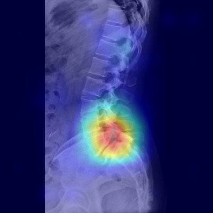
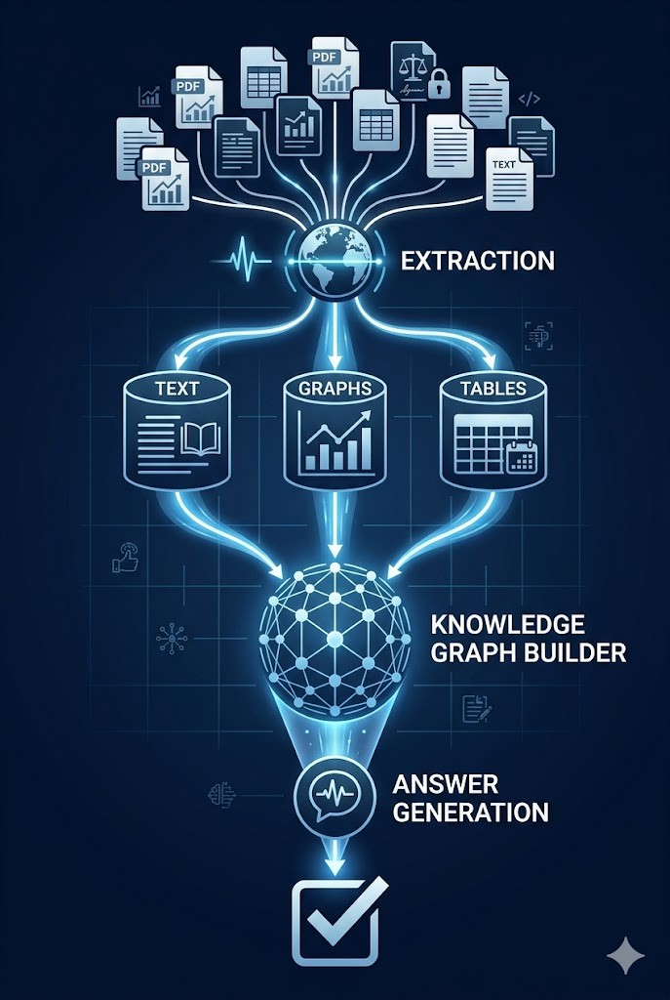

---
# https://vitepress.dev/reference/default-theme-home-page
layout: home

hero:
  name: "AEGIS Lab"
  text: ""
  tagline: Advanced Engineering & Goal-oriented Intelligence Solutions
  image: 
    src: ./.vitepress/public/graphs/Logo_v4.png
    alt: AEGIS Lab Logo
  actions:
    - theme: brand
      text: Portfolio
      link: /projects
    - theme: alt
      text: About
      link: /introduction/about

features:
  - title: Medical AI
    details: Proven track record in architecting multi-stage pipelines that consistently meet rigorous clinical benchmarks, achieving reliable performance metrics (exceeding 0.8) across complex diagnostic tasks.
    link: /projects/medical-ai
  - title: Edge Device (Jetson)
    details: Deploying on-device AI models for real-time processing, ensuring privacy and low-latency performance.
    link: /projects/edge-ai
  - title: Graph RAG
    details: Leveraging knowledge graphs to enhance retrieval precision and context-aware generation for complex queries.
    link: /projects/rag-system
  - title: AI-Drive Education
    details: Designing intelligent tutoring systems with reinforcement learning to provide personalized learning paths.
    link: /projects/teaching-system
---

